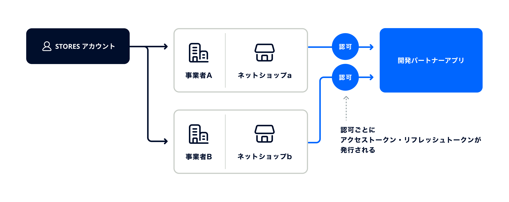

## STORES アカウントで認可できる事業者数の変更について



1つの STORES アカウントで複数事業者(またはネットショップ)の認可を可能とする変更を2024年10月中旬ごろに予定しております。  
なお、現在も別の STORES アカウントから複数の事業者から認可依頼がされることはありました。既にアクセストークン・リフレッシュトークンを複数保持できる実装になっている場合は修正は不要です。

変更前
```
STORES アカウント : 事業者 = 1 : 1
```

変更後
```
STORES アカウント : 事業者 = 1 : N
```

事業者の認可ごとにアクセストークン・リフレッシュトークンが発行されます。

あわせて、連携中の事業者配下ネットショップ名を取得する API を実装する予定となっております。  
上記のAPIにより、ユーザの利便性向上のためネットショップ名を画面に表示することなどが可能となります。

### 複数事業者との連携を維持する場合
認可ごとに発行されるアクセストークン・リフレッシュトークンを複数保持できるように、パートナーアプリの修正を行っていただく必要があります。  
既にアクセストークン・リフレッシュトークンを複数保持できる実装になっている場合は修正は不要です。  
先述の通り、連携中の事業者配下のネットショップ名を取得するための API からネットショップ名を取得し、画面に表示していただくことをおすすめいたします。

### 複数事業者との連携を維持しない場合
パートナーアプリの実装次第ではありますが、後から認可した事業者のアクセストークン・リフレッシュトークンのみ保持している状態になると考えられます。  
複数事業者の認可に対応していない旨を パートナーアプリの FAQ 等に記載すること、連携中の事業者配下のネットショップ名を取得するための API からネットショップ名を取得し、画面に表示していただくことをおすすめいたします。

